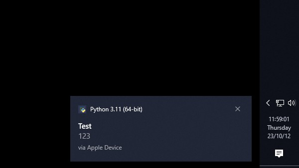
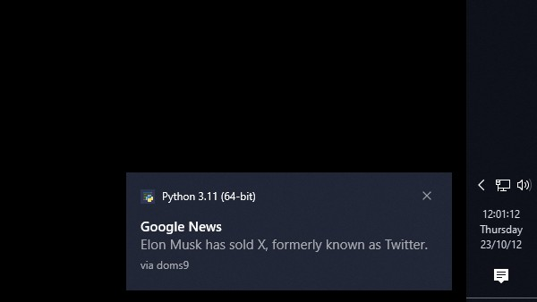

server for the [iOS based tweak](https://chariz.com/get/forwardnotifier)

**windows only** & python 3.10+

allow executable through windows' firewall after installing

edit device name through config.ini in install directory

---

_examples_

